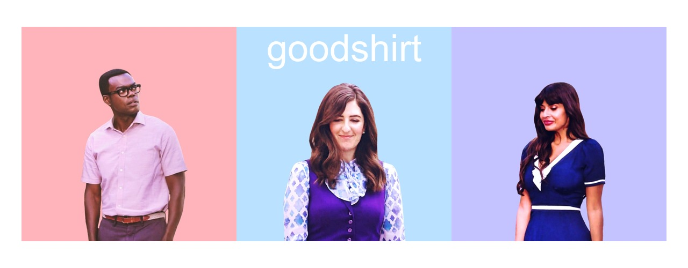

<!-- README.md is generated from README.Rmd. Please edit that file -->

```{r setup, include = FALSE}
knitr::opts_chunk$set(
  collapse = TRUE,
  comment = "#>",
  fig.path = "man/figures/README-",
  out.width = "100%"
)
```



# goodshirt

The goal of goodshirt is to provide an R client to The Good Place Quotes API by
Klaudia Rozgonyiova.  https://glitch.com/~good-place-quotes https://github.com/EffingKay/the-good-place-quotes

## Installation

```{r install,  eval=FALSE}
# install.packages("devtools")
devtools::install_github("adam-gruer/goodshirt")
```

## Example

Get a random quote

```{r example}
library(goodshirt)

soul_squad()

chidi()

derek()

eleanor()

janet()

jason()

michael()

pillboi()

tahani()


library(cowsay)
library(magrittr)

soul_squad() %>% 
  as.character() %>% 
  say(by = "random")

```


