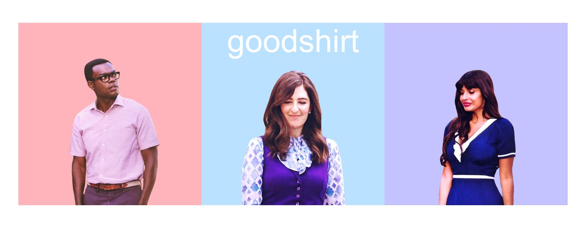

<!-- README.md is generated from README.Rmd. Please edit that file -->



# Note please upgrade to version 3.0.0

The Good Place quotes API is no longer available. v 3.0.0 ships the
quote data with the package and remover calls to the defunct api.

# goodshirt

The goal of goodshirt is to provide The Good Place Quotes in your R
session. Previously an R client to The Good Place Quotes API by Klaudia
Rozgonyiova. <https://glitch.com/~good-place-quotes>
<https://github.com/EffingKay/the-good-place-quotes>

Now in version 3.0.0 API calls are removed and quotes data ships with
the package

## Installation

``` r
# install.packages("devtools")
devtools::install_github("adam-gruer/goodshirt")
```

## Example

Get a random quote

``` r
library(goodshirt)

soul_squad()
#> 
#>  Pobody's nerfect. 
#> 
#>  ~ Eleanor

chidi()
#> 
#>  I have what doctors call "directional insanity". I once got lost on an escalator. 
#> 
#>  ~ Chidi

derek()
#> 
#>  Maximum Derek! 
#> 
#>  ~ Derek

eleanor()
#> 
#>  Okay, bud, whatever's going on right now, just shove your feelings way down deep, plaster on a fake smile, and pretend like you're having fun. Okay? Just like I used to do when someone started talking about their kids. 
#> 
#>  ~ Eleanor

janet()
#> 
#>  It turns out the best Janet was the Janet that was inside Janet all along. 
#> 
#>  ~ Janet

jason()
#> 
#>  She's my everything. She makes the bass drop in my heart. 
#> 
#>  ~ Jason

michael()
#> 
#>  You will spend eternity with murderers, and arsonists, and people who take off their shoes and socks on commercial airlines. 
#> 
#>  ~ Michael

pillboi()
#> 
#>  I refuse to discuss my fifth amendment rights until I concur with your attorney. 
#> 
#>  ~ Pillboi

tahani()
#> 
#>  It run for 16 years on the BBC. It did nearly 30 episodes. 
#> 
#>  ~ Tahani


library(cowsay)
#> Warning: package 'cowsay' was built under R version 4.2.2
library(magrittr)
#> Warning: package 'magrittr' was built under R version 4.2.2

soul_squad() %>% 
  as.character() %>% 
  say(by = "random")
#> 
#>  ------------- 
#> I also dabbled in some other professions. I was a model, a museum curator, an "It Girl," and... oh, I was Baz Luhrmann's muse for a while. That was quite fun.
#> ~ Tahani 
#>  -------------- 
#>               \   
#>                \  
#>                 \
#>                .--.
#>               /} p \             /}
#>              `~)-) /           /` }
#>               ( / /          /`}.' }
#>                / / .-'""-.  / ' }-'}
#>               / (.'       \/ '.'}_.}
#>              |            `}   .}._}
#>              |     .-=-';   } ' }_.}
#>              \    `.-=-;'  } '.}.-}
#>               '.   -=-'    ;,}._.}
#>                 `-,_  __.'` '-._}
#>               jgs   `|||
#>                    .=='=,
```
